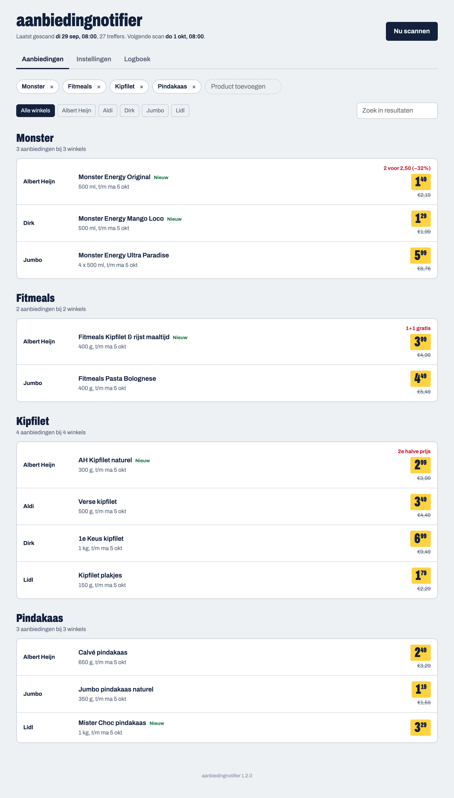
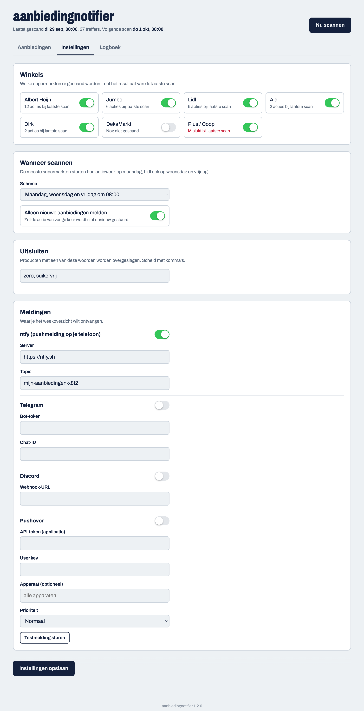
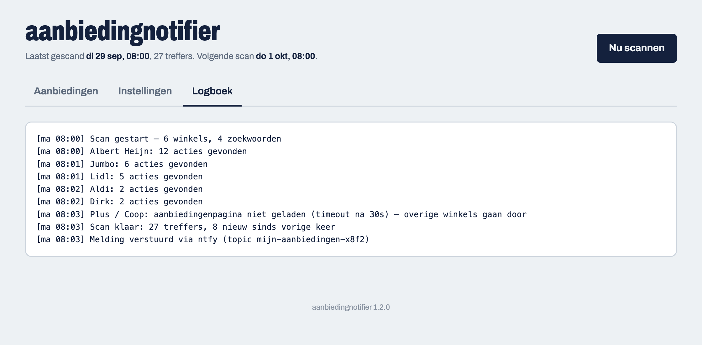

# aanbiedingnotifier

Scant elke week de acties van **Albert Heijn, Jumbo, Lidl, Aldi, Dirk, DekaMarkt en Plus**
(inclusief voormalige Coop-winkels) op producten die jij opgeeft, bijv. Monster of Fitmeals,
en stuurt je een pushmelding.

## Screenshots

De webinterface op poort 4040 heeft drie tabbladen. *(Voorbeelden met fictieve data.)*

**Aanbiedingen** — resultaten gegroepeerd per product dat je volgt, met de prijs, de actie
(bijv. *2e halve prijs* of *1+1 gratis*), de oude prijs en een **Nieuw**-markering voor acties
sinds de vorige scan. Filter op winkel of zoek erdoorheen.



**Instellingen** — winkels aan/uit met het resultaat van de laatste scan, het scanschema,
uitsluitwoorden en de meldingskanalen (ntfy, Telegram, Discord, Pushover) met testknop.



**Logboek** — live meekijken tijdens een scan; per winkel zie je wat er gevonden is en waar
het misging.



## Versies

Elke release krijgt een eigen image-tag, bijv. `ghcr.io/richrdj/aanbiedingnotifier:1.0.0`. `latest` volgt de main-branch.

## Snelst: kant-en-klare stack

Gebruik `stack.yml` (plakken in Portainer of `docker compose -f stack.yml up -d`). Die gebruikt de image van GHCR, dus bouwen is niet nodig. Open daarna http://<server-ip>:4040.

## Zelf bouwen

```bash
docker compose up -d --build
```

Open daarna **http://<server-ip>:4040**. Daar voeg je producten toe, kies je winkels,
het scanschema en je meldingen, en start je een scan met één klik. De instellingen
komen in `./config/config.yaml` (wordt automatisch aangemaakt) en kun je ook met de hand bewerken.

### GUI

- **Aanbiedingen:** resultaten per product dat je volgt, filter op winkel of zoek. Nieuwe acties sinds de vorige scan zijn gemarkeerd.
- **Instellingen:** winkels aan/uit met het resultaat van de laatste scan, scanschema, uitsluitwoorden en meldingen (met testknop).
- **Logboek:** live meekijken tijdens een scan.

Is de GUI buiten je thuisnetwerk bereikbaar, zet dan `GUI_PASSWORD` in `docker-compose.yml`;
de GUI vraagt dan om een wachtwoord (gebruikersnaam maakt niet uit).

## Hoe het per winkel werkt

| Winkel | Methode |
|---|---|
| Albert Heijn | App-API (anoniem token), zoekt per zoekwoord op bonusproducten |
| Dirk, DekaMarkt | Acties uit de server-gerenderde aanbiedingenpagina (geen browser nodig) |
| Jumbo, Lidl, Aldi, Plus | Headless Chromium rendert de aanbiedingenpagina en leest de productkaarten |

Als een winkel zijn layout verandert en de productkaarten niet meer herkend worden,
valt de scanner terug op het doorzoeken van alle tekst op de aanbiedingenpagina, zodat
je in de meeste gevallen toch een melding krijgt. Faalt een winkel helemaal, dan gaan de
andere gewoon door; de fout staat in de logs.

**Coop:** Coop NL is opgegaan in Plus (coop.nl stuurt door naar plus.nl), daarom scant
de `plus`-bron ook "Coop". `coop: true` in de config werkt als alias.

## Meldingen

Makkelijkst: installeer de gratis **ntfy**-app en abonneer je op het topic uit `config.yaml`.
Telegram, Discord en Pushover kunnen ook.

## Instellingen (docker-compose.yml)

| Variabele | Standaard | Uitleg |
|---|---|---|
| `GUI_PORT` | `4040` | Poort van de GUI |
| `GUI_PASSWORD` | leeg | Wachtwoord voor de GUI (aanrader buiten je thuisnetwerk) |
| `SCHEDULE` | `0 8 * * 1` | Standaard cron-schema als er in de config niets staat |
| `RUN_ON_START` | `false` | Direct scannen bij opstarten |
| `RUN_ONCE` | `false` | Eén keer scannen en stoppen |

## Kant-en-klare image

De GitHub Action in `.github/workflows/docker.yml` bouwt bij elke push naar `main`
een image voor amd64 en arm64 (Raspberry Pi/NAS) naar
`ghcr.io/<gebruiker>/aanbiedingnotifier:latest`.

## Output

`./data/latest.md` (overzicht), `latest.json` (ruwe data), `seen.json` (voor `only_new`).

## Let op

Geen van deze supermarkten heeft een officiële openbare API. Pagina's en app-API's kunnen
zonder aankondiging veranderen; dan moet een bron in `app/sources/` worden bijgewerkt.

## Winkel toevoegen

Maak een klasse in `app/sources/` met `fetch_all() -> list[Offer]` (alle acties) of
`search(query) -> list[Offer]` (alleen producten in de aanbieding) en registreer hem in
`SOURCES` in `app/main.py`.
